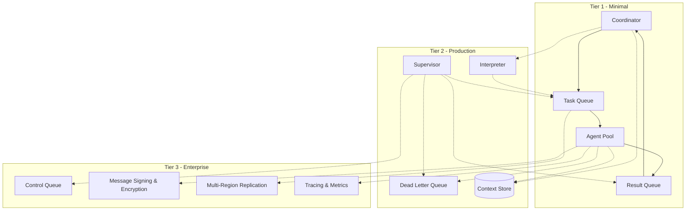
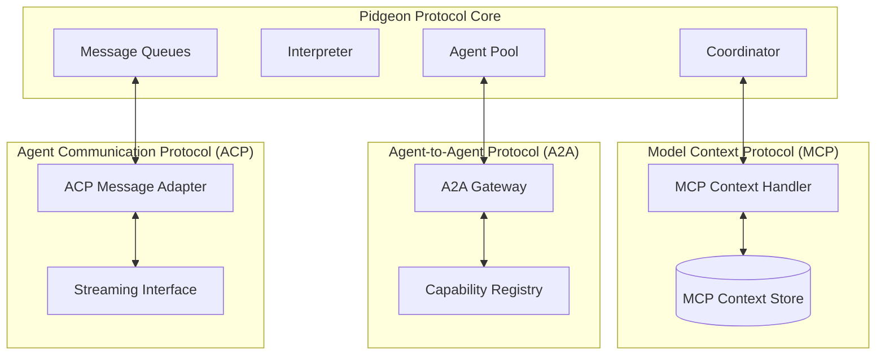

# Pidgeon Protocol (): Emerging AI-to-AI Communication Framework

## 1. Executive Summary

**Pidgeon Protocol ()** is an emerging communication framework designed to become the foundational protocol for autonomous and collaborative AI systems. It replaces brittle, synchronous agent-to-agent links with a fault-tolerant, message-queue-based coordination layer. This enables AI agents—across vendors, models, and frameworks—to cooperate seamlessly, securely, and at scale.

Today’s multi-agent systems depend on direct API calls or proprietary orchestration stacks. When one component fails, entire workflows stall. The **Pidgeon Protocol** abstracts coordination into asynchronous message exchanges, ensuring reliability and interoperability across heterogeneous AI environments. This approach extends beyond the Model Context Protocol (MCP) to support a broader AI-to-AI communication ecosystem.

By decoupling intelligence from infrastructure, the Pidgeon Protocol establishes the foundation for an **open coordination layer** that could evolve into a formal protocol standard—diminishing the competitive moat of closed “one-click” AI providers and creating an opportunity for a horizontal, standardized infrastructure layer in the emerging AI economy.

---

## 2. Problem Context: The AI Interoperability Gap

- **Direct coupling** between AI agents causes cascading failures and scaling inefficiencies.
- **Heterogeneous ecosystems** (LLMs, tools, APIs, domain agents) lack a shared communication standard.
- **Auditability and compliance** remain weak—message traces vanish after execution.
- **Vendor lock-in** dominates orchestration, hindering innovation.

An AI-to-AI infrastructure must therefore deliver reliability, independence, and semantic interoperability—without depending on proprietary hubs.

---

## 3. The Pidgeon Protocol Solution

The **Pidgeon Protocol** implements a **queue-centric coordination fabric** for AI ecosystems. All agent interactions occur via asynchronous message passing, eliminating synchronous dependencies and enabling independent scaling of each subsystem.

Agents communicate through structured messages validated by shared schemas and enriched with semantic metadata. This design ensures that any compliant agent—irrespective of implementation—can join the network and participate in workflows without modification.

### Architectural Principles
- **Asynchronous Message Passing** – replaces direct RPC-style agent calls.
- **Schema Validation** – guarantees message integrity and interoperability.
- **Fault Isolation** – prevents cascading failures.
- **Independent Scaling** – each component scales by workload demand.
- **Protocol-Agnostic Integration** – supports MCP, A2A, and ACP.

---

## 4. Core Architecture

### 4.1 Tiered Implementation Overview

**Tier 1 – Minimal Core**
- Coordinator: orchestrates workflows and decomposes tasks.
- Agents: stateless executors.
- Task & Result Queues: communication backbone.

**Tier 2 – Production Layer**

- Interpreter: schema validation and metadata enrichment.
- Supervisor: centralized policy enforcement and failure recovery.
- Context Store: persistent workflow state.
- Dead Letter Queue: isolates persistent errors.

**Tier 3 – Enterprise Layer**
- Control Queues for runtime intervention.
- Cryptographic signing & encryption.
- Multi-region federation & distributed tracing.

This modularity allows organizations to adopt incrementally—starting from minimal deployments and growing toward enterprise-grade resilience.

---

## 5. Integration and Ecosystem Fit

The **Pidgeon Protocol** bridges multiple interoperability standards:

By supporting **MCP**, **A2A**, and **ACP**, the **Pidgeon Protocol** acts as a **universal bridge layer**. It enables agents across clouds and vendors to coordinate securely and semantically through common message schemas—creating an open AI fabric. Over time, these conventions can evolve into a formal, published communication protocol.

---

## 6. Technical Differentiation & IP Position

- **Queue-Centric AI Orchestration:** First integration of distributed systems queueing patterns into AI multi-agent workflows.
- **Supervisor Component:** Autonomous fault detection, retry logic, and policy enforcement.
- **Schema-Enforced Messaging:** JSON Schema + versioned contracts enabling cross-agent evolution.
- **Protocol Fusion:** Seamless interoperability between MCP, A2A, and ACP ecosystems.
- **Compliance-Ready Auditability:** Immutable message histories for forensic traceability.

While leveraging open-source components (Kafka, RabbitMQ, Kubernetes), differentiation arises from integration logic, supervision design, and cross-protocol message semantics.

---

## 7. Scalability, Reliability & Security

### Scalability
- Competing consumer pattern allows **linear throughput scaling**.
- Independent scaling of each agent type based on queue depth.
- Multi-region federation ensures cross-geography reliability.

### Reliability
- Built-in **fault isolation**, **dead letter handling**, and **automatic retries**.
- Supervisor component maintains systemic stability.
- Queue persistence ensures zero message loss.

### Security
- **TLS encryption** in transit, **encryption-at-rest** for broker data.
- **Cryptographic message signing** for integrity and origin verification.
- **Role-Based Access Control (RBAC)** and key rotation.

---

## 8. Market Opportunity and Strategic Implications

AI systems are evolving from monolithic assistants to ecosystems of specialized agents. Each major model provider is building proprietary coordination stacks—OpenAI’s Agents SDK, Anthropic’s MCP, and Google’s Gemini Orchestrations. These vertical ecosystems are **not interoperable**.

The **Pidgeon Protocol** offers the **horizontal infrastructure layer** enabling these ecosystems to communicate through a shared substrate. This mirrors what TCP/IP did for early computer networks—transforming isolated systems into the Internet.

**Strategic Implications:**
- Reduces vendor lock-in for enterprises.
- Creates a standard for AI interoperability.
- Unlocks a new market for **AI middleware infrastructure** akin to what cloud brokers were for compute.

---

## 9. Roadmap

1. **Q1–Q2:** Open-source reference implementation (Tier 1–2).
2. **Q3:** Enterprise-ready Supervisor and Federation modules.
3. **Q4:** Integration SDKs for MCP, A2A, ACP ecosystems.
4. **2026:** Policy-driven orchestration layer and semantic observability.
5. **Beyond:** Federated learning and encrypted AI collaboration support.

---

## 10. Closing Summary

The **Pidgeon Protocol (飞鸽传书)** represents the **emergence of a new AI coordination framework** that standardizes agent communication. By replacing point-to-point integrations with a universal, asynchronous message infrastructure, it provides the missing foundation for an open AI ecosystem.

This architecture not only solves interoperability and reliability at scale—it lays the groundwork for what can evolve into a true protocol layer: **AI-native messaging for autonomous collaboration.**

> **Investment Rationale:** The company behind the Pidgeon Protocol is building the connective tissue for the AI era—the coordination framework that will mature into a global standard for intelligent system communication.
