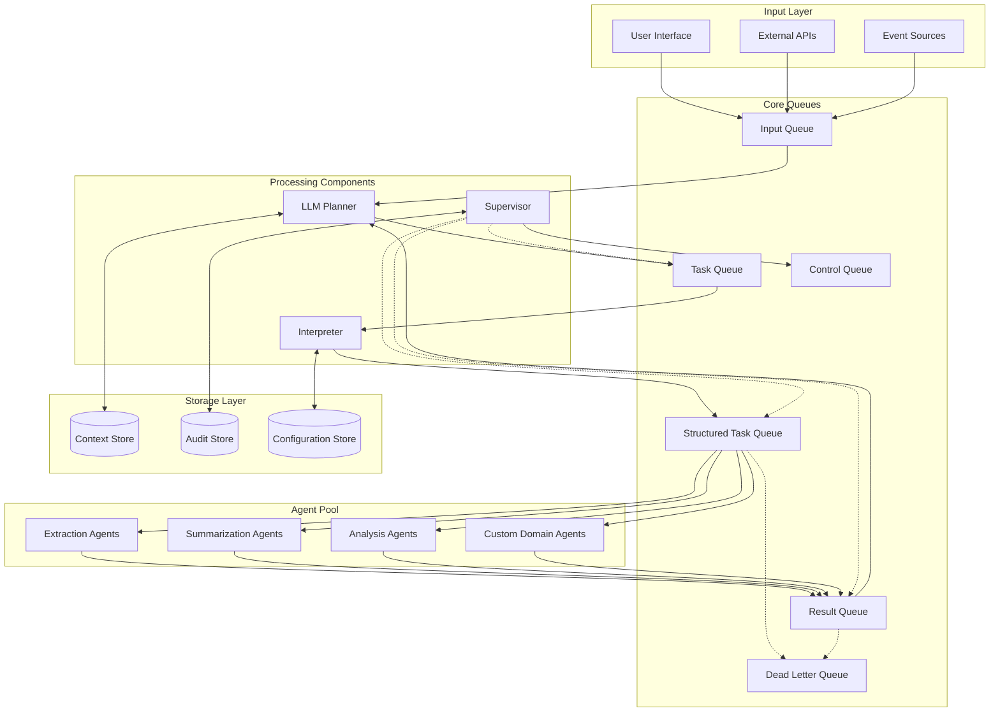
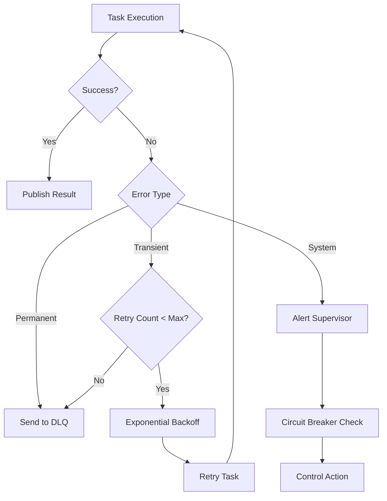
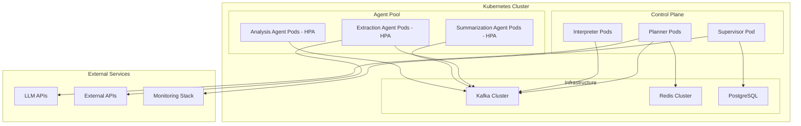

# Design Document

## Overview

The Pidgeon Protocol implements a queue-centric, event-driven architecture for multi-agent AI coordination. The system replaces synchronous agent-to-agent calls with asynchronous message passing through typed queues, enabling fault isolation, independent scaling, and comprehensive observability. The architecture supports three deployment tiers (Minimal, Production, Enterprise) to accommodate different organizational needs and maturity levels.

## Architecture

### High-Level Architecture

The system follows a hub-and-spoke pattern with message queues as the central coordination mechanism. All components communicate exclusively through queues, eliminating direct dependencies and enabling loose coupling.



### Tiered Implementation Strategy

**Tier 1 - Minimal Core**
- Essential components for basic functionality
- Single-node deployment capability
- In-memory queues for development/testing

**Tier 2 - Production Ready**
- Persistent message brokers
- Fault tolerance and recovery mechanisms
- Monitoring and observability

**Tier 3 - Enterprise Scale**
- Multi-region federation
- Advanced security features
- Compliance and governance tools

## Components and Interfaces

### LLM Planner

**Responsibilities:**
- Parse user inputs and decompose into executable tasks
- Coordinate workflow execution based on results
- Adapt plans dynamically based on feedback
- Synthesize final results from agent outputs

**Interfaces:**
- Consumes from: Input Queue, Result Queue
- Produces to: Task Queue
- Storage: Context Store for workflow state

**Key Design Decisions:**
- Stateless design with persistent context storage
- Plugin architecture for different LLM providers
- Configurable planning strategies (linear, parallel, adaptive)

### Interpreter

**Responsibilities:**
- Validate task messages against schemas
- Enrich messages with routing metadata
- Transform between protocol formats (MCP, A2A, ACP)
- Enforce message versioning and compatibility

**Interfaces:**
- Consumes from: Task Queue
- Produces to: Structured Task Queue
- Storage: Configuration Store for schemas and routing rules

**Key Design Decisions:**
- JSON Schema validation with versioning support
- Pluggable protocol adapters
- Configurable routing policies based on task type and priority

### Supervisor

**Responsibilities:**
- Monitor system health and message flows
- Enforce reliability policies (retries, circuit breakers)
- Implement control actions (pause, reroute, throttle)
- Maintain audit trails and compliance data

**Interfaces:**
- Monitors: All queues (read-only)
- Produces to: Control Queue
- Storage: Audit Store for compliance and forensics

**Key Design Decisions:**
- Event-driven monitoring with configurable thresholds
- Policy engine for automated decision making
- Immutable audit logging for compliance

### Specialized Agents

**Responsibilities:**
- Process domain-specific tasks atomically
- Publish results with appropriate status codes
- Handle errors gracefully with structured reporting
- Scale horizontally based on workload

**Interfaces:**
- Consumes from: Structured Task Queue (by task type)
- Produces to: Result Queue
- Storage: Optional local caching for performance

**Key Design Decisions:**
- Stateless design for horizontal scaling
- Containerized deployment for isolation
- Plugin architecture for custom agent types

## Data Models

### Message Envelope

```json
{
  "header": {
    "message_id": "uuid",
    "correlation_id": "uuid", 
    "context_id": "urn:mcp:session-id",
    "actor_role": "planner|interpreter|agent|supervisor",
    "task_type": "EXTRACTION|SUMMARIZATION|ANALYSIS|CUSTOM",
    "priority": 1,
    "ttl_ms": 30000,
    "schema_version": "v1.0",
    "enqueue_ts": "2024-01-01T00:00:00Z",
    "processing_ts": "2024-01-01T00:00:01Z",
    "retry_count": 0,
    "max_retries": 3
  },
  "payload": {
    "task_data": {},
    "context": {},
    "metadata": {}
  },
  "signature": "cryptographic_signature_optional"
}
```

### Task Definition

```json
{
  "task_id": "uuid",
  "task_type": "EXTRACTION",
  "input_data": {
    "document_url": "https://example.com/doc.pdf",
    "extraction_type": "text"
  },
  "requirements": {
    "output_format": "json",
    "quality_threshold": 0.95
  },
  "constraints": {
    "max_processing_time_ms": 30000,
    "required_capabilities": ["ocr", "nlp"]
  }
}
```

### Result Schema

```json
{
  "result_id": "uuid",
  "task_id": "uuid",
  "status": "SUCCESS|ERROR|PARTIAL",
  "output_data": {},
  "metadata": {
    "processing_time_ms": 1500,
    "confidence_score": 0.98,
    "agent_id": "extraction-agent-001"
  },
  "error_details": {
    "error_code": "TIMEOUT",
    "error_message": "Processing exceeded time limit",
    "retry_recommended": true
  }
}
```

## Error Handling

### Error Classification

1. **Transient Errors** - Network timeouts, temporary resource unavailability
2. **Permanent Errors** - Invalid input data, unsupported operations
3. **System Errors** - Component failures, resource exhaustion

### Retry Strategy



### Dead Letter Queue Processing

- Automatic routing of failed messages after retry exhaustion
- Manual triage interface for error analysis
- Replay capability for corrected messages
- Alerting for critical error patterns

## Testing Strategy

### Unit Testing
- Component isolation with mock queue interfaces
- Schema validation testing with edge cases
- Error handling verification for all failure modes
- Performance testing for individual components

### Integration Testing
- End-to-end workflow validation
- Cross-component message flow verification
- Protocol interoperability testing (MCP, A2A, ACP)
- Failure scenario testing (component crashes, network partitions)

### Performance Testing
- Load testing with realistic message volumes
- Latency measurement across queue hops
- Scalability testing with varying agent pool sizes
- Resource utilization monitoring under stress

### Security Testing
- Message integrity verification
- Access control validation
- Encryption/decryption performance
- Penetration testing for queue security

## Protocol Integration

### Model Context Protocol (MCP) Integration

The system preserves MCP context across message boundaries by embedding context information in message headers:

```json
{
  "header": {
    "context_id": "urn:mcp:patient-intake-session-045",
    "actor_role": "clinical-assistant", 
    "session_state": "active",
    "checkpoint_id": "checkpoint-123"
  }
}
```

### Agent-to-Agent (A2A) Protocol Support

Capability discovery and negotiation through dedicated message types:

```json
{
  "task_type": "CAPABILITY_DISCOVERY",
  "payload": {
    "requested_capabilities": ["document-analysis", "medical-coding"],
    "quality_requirements": {"accuracy": 0.95, "latency_ms": 5000}
  }
}
```

### Agent Communication Protocol (ACP) Adaptation

Support for streaming and multimodal content through chunked message patterns:

```json
{
  "task_type": "STREAMING_ANALYSIS",
  "payload": {
    "stream_id": "stream-456",
    "chunk_sequence": 1,
    "chunk_data": "base64_encoded_content",
    "is_final": false
  }
}
```

## Security Architecture

### Message Security
- TLS 1.3 for all queue communications
- Optional message-level encryption for sensitive payloads
- Cryptographic signatures for message integrity
- Key rotation policies for long-term security

### Access Control
- Role-Based Access Control (RBAC) for queue access
- Service-to-service authentication via mutual TLS
- API key management for external integrations
- Audit logging for all security events

### Agent Sandboxing
- Containerized agent execution environments
- Resource limits and network restrictions
- Scoped credentials for external service access
- Runtime security monitoring

## Deployment Architecture

### Cloud-Native Deployment



### Message Broker Selection

**Apache Kafka**
- High throughput and durability
- Partitioned ordering for parallel processing
- Long-term message retention for audit trails
- Recommended for high-volume production deployments

**RabbitMQ**
- Flexible routing topologies
- Rich protocol support (AMQP, MQTT, STOMP)
- Lower operational complexity
- Recommended for moderate-volume deployments

### Scaling Patterns

1. **Horizontal Agent Scaling** - Add more agent instances based on queue depth
2. **Vertical Component Scaling** - Increase resources for CPU/memory intensive components
3. **Queue Partitioning** - Distribute load across multiple queue partitions
4. **Regional Distribution** - Deploy components across multiple regions for latency optimization

## Observability and Monitoring

### Metrics Collection
- Queue depth and processing rates
- Message latency and throughput
- Agent performance and error rates
- Resource utilization across components

### Distributed Tracing
- End-to-end request tracing with correlation IDs
- Component-level span tracking
- Performance bottleneck identification
- Error propagation analysis

### Alerting Strategy
- Queue depth thresholds for capacity planning
- Error rate spikes for reliability monitoring
- Performance degradation for SLA compliance
- Security event detection for incident response