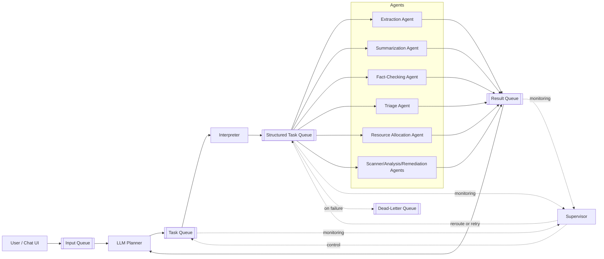
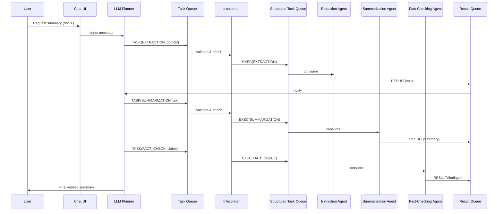
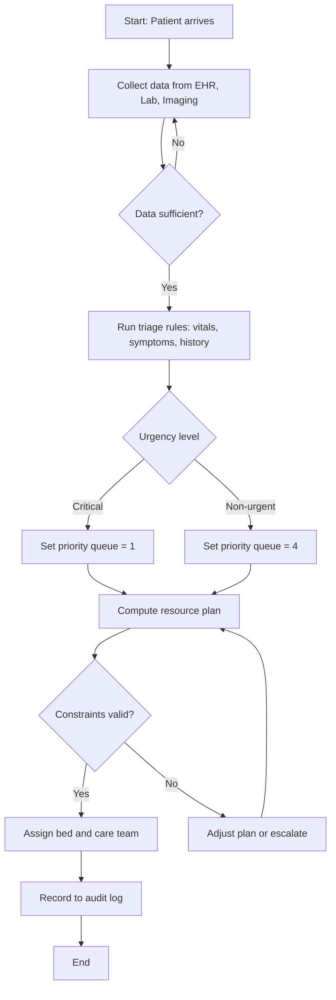
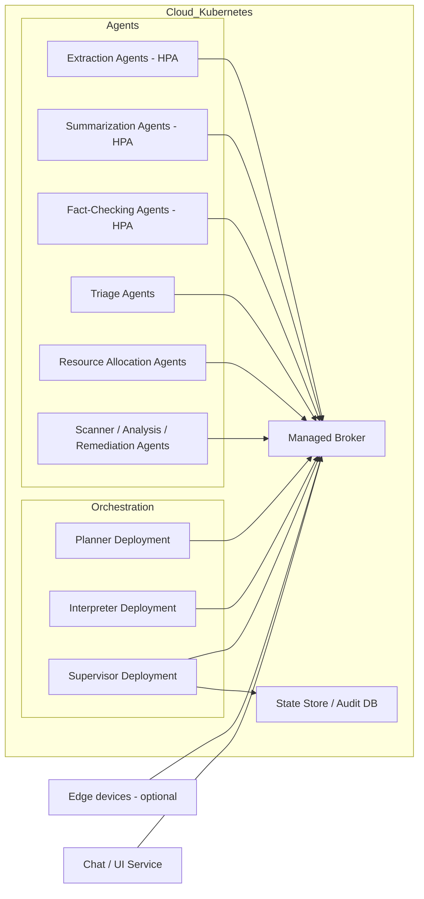
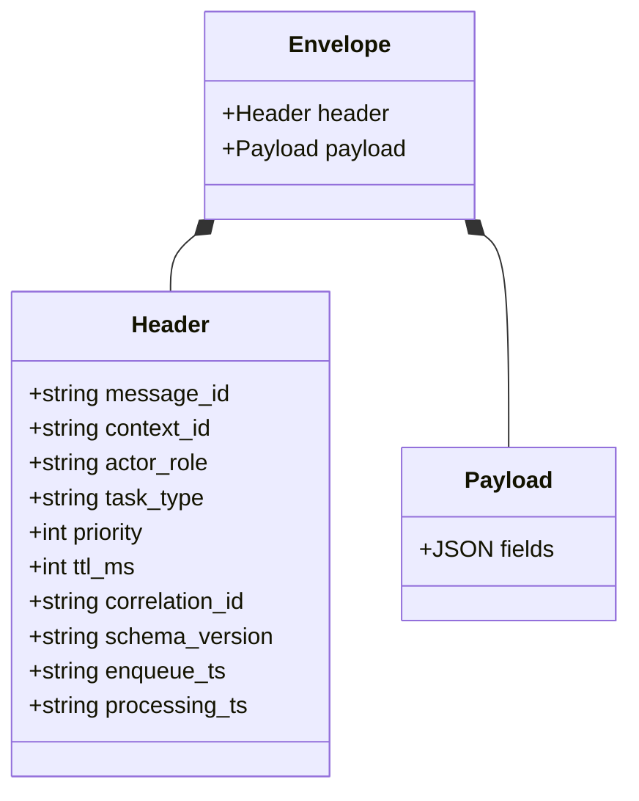

# A Queue‑Based Redesign for Scalable, Resilient AI Coordination: Applications in Healthcare and Vulnerability Management
#UNPUBLISHED, SO THIS IS NOT PEER REVIEWED.
**Author:** Jiarui Li 

---

## Abstract
Modern multi‑agent AI systems struggle with coordination, scalability, and fault tolerance as workloads and integration complexity grow. Architectures built on direct agent‑to‑agent calls create brittle dependencies and hinder observability, compliance, and performance tuning. This paper proposes a **queue‑centric, event‑driven architecture** that decouples a **Planner**, **Interpreter**, **Supervisor**, and **specialized Agents** via asynchronous message queues. The design provides **elastic scalability, fault isolation, end‑to‑end traceability**, and **protocol‑level reliability** (retries, dead‑letter queues, priority routing, TTLs). We detail component roles, queue types, flow patterns, security and audit controls, integration with emerging protocols (e.g., MCP), and practical implementation paths. We then ground the approach in three representative domains—**document analysis**, **healthcare triage and resource optimization**, and **vulnerability management**—and discuss limitations and future work. We include **UML diagrams** to convey the architecture, message schemas, and execution flows.

---

## Keywords
multi‑agent systems; message queues; orchestration; reliability engineering; observability; MCP; healthcare; cybersecurity; scalability

---

## 1. Introduction

### 1.1 Problem Context
The rapid advancement of LLMs and domain‑specific agents has enabled complex, multi‑step workflows. Transitioning these systems from prototypes to production exposes operational hurdles: brittle dependencies, limited parallelism, opaque execution, and regulatory compliance gaps.

### 1.1.1 Current Architecture Paradigm and Limitations
A common pattern is a general LLM interface invoking a set of tools (e.g., MCP tools) via JSON configurations. The LLM both plans and coordinates execution, often with **linear, synchronous** tool calls. While simple, this approach suffers from:

- **Linear processing** that blocks parallelism and underutilizes compute.
- **Generalist planning** that misses domain‑specific optimizations.
- **Sparse observability**, complicating performance monitoring, RCA, auditing (e.g., under the EU AI Act), and capacity planning.
- **No intermediate feedback loops**, hindering validation, strategy adjustment, and iterative self‑correction.
- **Tight coupling, weak failover, limited scalability, and poor accountability** across message flows.

### 1.2 Architectural Innovation
We propose a **queue‑centric architecture**. Message queues become the system’s central nervous system, decoupling components and enabling asynchronous, event‑driven coordination. The result: **fault isolation, independent scaling, robust tracing,** and more predictable operations without sacrificing cognitive capability.

### 1.3 Paper Structure
Section 2 presents the architecture; Section 3 integrates modern coordination protocols; Section 4 covers implementation; Section 5 offers applications; Section 6 outlines limitations; Section 7 concludes. UML diagrams are provided at the end.

---

## 2. Architecture Overview
The system comprises four core components connected through typed queues to deliver resilient orchestration with comprehensive observability.

### 2.1 Core Components
1. **LLM Planner** — Parses intent, decomposes into tasks, and adapts plans based on results and feedback signals.
2. **Interpreter** — Enforces schemas and translates plan steps into **executable messages** with routing metadata (e.g., TTL, priority).
3. **Supervisor** — Observes task/result streams, enforces reliability policy (retry, backoff, circuit‑breaks), and performs control actions (pause, reroute, throttle).
4. **Specialized Agents** — Stateless workers subscribed by task type (summarization, OCR, triage, scanning, remediation, etc.). Each message is processed atomically; results are published back to the system.

> **Optional front‑end**: A conversational UI can publish inputs to an **Input/Conversation Queue**, buffering user traffic and isolating UX from backend variability.

### 2.2 Queue Types and Behaviors
- **Input Queue** — User inputs and external events.
- **Task Queue** — High‑level tasks emitted by the Planner.
- **Structured Task Queue** — Interpreter‑validated, executable tasks ready for agents.
- **Result Queue** — Agent outputs (success/error/status) consumed by Planner/Supervisor.
- **Dead‑Letter Queue (DLQ)** — Fault isolation for messages exceeding retry budgets or failing validation.

**Standard behaviors**
- **TTL** to prevent stale work; **priority** for urgent tasks; delivery **at‑least‑once** (combine with idempotency keys for **effectively‑once** effects); **ordering** when required (keys/partitions).

### 2.3 Flow Patterns
- **Linear** — Deterministic chain when parallelism is unnecessary.
- **Feedback** — Results refine plans (reflection, self‑critique, adaptive prompts).
- **Control** — Supervisory backpressure, retry, reroute, pause/resume, emergency stops.

### 2.4 Reliability and Fault Tolerance
Agents failing a task trigger retry with exponential backoff; messages that exceed budgets go to the DLQ for triage. Malformed messages are rejected by the Interpreter with structured errors. Queue buffering smooths bursts, and message histories provide durable audit logs.

### 2.5 Elastic Scalability
Because producers and consumers are decoupled, teams can **scale components independently** (competing consumers, sharding by task type, autoscaling based on lag, latency, or SLOs). This supports heterogeneous workloads, from batch analytics to near‑real‑time decisioning.

### 2.6 Auditability and Traceability
Inject correlation IDs end‑to‑end. Capture enqueue/dequeue timestamps, processing status codes, and actor identifiers. Maintain provenance for regulated domains (healthcare, finance), enabling post‑hoc review and continuous improvement.

### 2.7 Security Considerations
- **TLS in transit**, **RBAC** per queue and agent, and **message signing** (authenticity/integrity).
- **Sandboxed execution** for agents; scoped credentials for external calls.
- **Least privilege** and **segregation of duties** across Planner, Supervisor, and Agents.

---

## 3. Integrating Modern Protocols (e.g., MCP)

### 3.1 Motivation
Contracts and isolation are necessary but not sufficient for semantic continuity. The **Model Context Protocol (MCP)** helps preserve **workflow context, actor roles,** and **checkpointing** across retries and agent hops.

### 3.2 Integration Strategy
Augment message headers with MCP fields:

```json
{
  "header": {
    "message_id": "abc-123",
    "context_id": "urn:mcp:patient-intake-session-045",
    "actor_role": "clinical-assistant",
    "task_version": "3.4"
  },
  "payload": { /* structured task data */ }
}
```

### 3.3 Benefits
- **Fault‑tolerant memory** across non‑linear flows.
- **Semantic audit trails** (beyond raw logs) for regulated reviews.
- **Coordination efficiency** via shared intent and roles.
- **Protocol‑level interoperability** with future agent ecosystems.

### 3.4 Related Protocols
- **A2A (Agent‑to‑Agent)** — Capability discovery and intent negotiation across organizational boundaries.
- **ACP (Agent Communication Protocol)** — Rich streaming/multimodal semantics with flexible metadata.
- **FHIR** (domain‑specific) — For healthcare interoperability; can be encapsulated or transformed by the Interpreter.

---

## 4. Implementation Considerations

### 4.1 Technology Selection
**Queues/Brokers**
- **Apache Kafka** — High throughput, durable retention, partitioned ordering.
- **RabbitMQ** — Flexible routing topologies, rich protocol support.

**Components**
- **Planner** — Containerized clients of hosted or local LLMs.
- **Interpreter** — JSON Schema / Protobuf / Avro validation and routing.
- **Supervisor** — Stateful control plane (e.g., Spring Boot, Django, Express) + persistent state store.
- **Agents** — Stateless workers as microservices or serverless functions (Lambda/Azure/Cloud Functions).

### 4.2 Deployment Models
- **Cloud‑native** — Kubernetes for microservices, managed brokers, serverless for bursty stateless tasks.
- **Hybrid** — Sensitive data on‑prem; scalable analytics in cloud; **edge** agents for low‑latency or intermittently connected sites.

---

## 5. Real‑World Applications

### 5.1 Multi‑Agent Document Analysis Pipeline
**Goal:** Extract → summarize → fact‑check documents at scale.

**Workflow:** The Planner receives a request (e.g., “Analyze document X and provide a fact‑checked summary”). It enqueues **EXTRACTION** tasks; **Extraction Agents** (OCR if needed) return cleaned text to the Result Queue. The Planner enqueues **SUMMARIZATION** tasks; **Summarization Agents** return candidate summaries. It then enqueues **FACT_CHECK** tasks; **Fact‑Checking Agents** verify claims (calling internal/external sources) and return findings. The Planner synthesizes a final, verified summary, or—on deadline—returns a summary with disclaimers if verification is delayed (bounded by TTL/priority).

**Parallelism:** Multiple documents can fan out to multiple Extraction/Summarization agents concurrently; priority routing ensures interactive requests preempt batch jobs.

### 5.2 Distributed Simulation Agents (Newly completed)
**Goal:** Real‑time virtual environment simulation with modular physics, perception, and policy agents.

**Workflow:** The Planner emits **SIM_TICK** tasks with world state deltas. **Physics Agents** compute dynamics; **Perception Agents** render/label observations; **Policy Agents** decide actions; **Aggregation Agents** reconcile results. The Supervisor enforces tick deadlines (drop/skip rules, DLQ on overdue tasks) and orchestrates rollback or stochastic replay when invariants are violated.

**Benefits:** Fault isolation prevents a failing subsystem (e.g., perception) from halting the entire sim; scaling is independent per subsystem; strict traceability supports reproducible research.

### 5.3 Healthcare Resource Optimization and Triage Support
**Goal:** Continuous resource allocation and emergency triage decisions across hospital systems.

**Workflow:** The Planner coordinates **DATA_COLLECTION** tasks across EHR, lab, imaging, etc.; **Triage Agents** apply evidence‑based rules to produce urgency levels and care pathways; **Resource Allocation Agents** compute bed/equipment/staffing plans subject to constraints; **Constraint Checking Agents** validate plans versus policy/regulation. Control flows allow emergency overrides with full audit trails.

### 5.4 Vulnerability Management and Adaptive Remediation
**Goal:** Discover, analyze, prioritize, and remediate vulnerabilities across an enterprise.

**Workflow:** **Scanner Agents** execute segmented scans; the Interpreter normalizes findings; **Analysis Agents** enrich with threat intel and asset criticality; **Prioritization Agents** generate risk scores and SLAs; **Remediation Planning Agents** create staged changes; **Execution Agents** implement fixes while **Verification Agents** confirm remediation. The Supervisor coordinates windows, backoffs, and emergency stops; DLQ captures edge cases.

---

## 6. Limitations and Future Work

### 6.1 Current Limitations
- **Latency:** Queue hops add ~50–200 ms per transition; real‑time paths need careful minimization and potentially in‑memory queues.
- **State Management:** Long‑running workflows need persistent state and robust correlation/causation tracking (ids, checkpoints, event sourcing).
- **Complexity:** Schema evolution, DLQ triage, and distributed debugging demand disciplined tooling and documentation.

### 6.2 Mitigations
- Direct channels for ultra‑low‑latency segments; batching where appropriate; regional placement and efficient (de)serialization.
- Dedicated state service; eventual consistency; checkpointing and recovery; pervasive tracing.
- Strong schema versioning and compatibility tests; contextual retry policies; simulation/sandboxes; living runbooks.

### 6.3 Future Work
- Adaptive planning with learned controllers for queue policies (priority/TTL/backoff).
- Formal verification of safety properties for healthcare/cyber workflows.
- Deeper MCP/A2A/ACP interop and standard payload ontologies.

---

## 7. Conclusion
A queue‑centric, event‑driven design unlocks **resilience, scalability, and auditability** for multi‑agent AI. By decoupling planning, interpretation, supervision, and execution through typed queues and explicit contracts, organizations can operate AI systems that meet production SLOs and regulatory expectations while remaining flexible to evolving tools and models. The approach proves effective across document pipelines, healthcare triage, and vulnerability management, and is broadly extensible to other complex domains.

---

## Appendix A — Message Envelope (Illustrative)
```json
{
  "header": {
    "message_id": "uuid",
    "context_id": "urn:mcp:...",
    "actor_role": "{planner|interpreter|agent|supervisor}",
    "task_type": "EXTRACTION|SUMMARIZATION|...",
    "priority": 1,
    "ttl_ms": 30000,
    "correlation_id": "uuid",
    "schema_version": "v1"
  },
  "payload": { }
}
```

---

# UML Diagrams

> The following diagrams use Mermaid syntax to depict components, interactions, activities, deployment, and message schemas.

## Figure 1 — Component/Queue Diagram


## Figure 2 — Sequence Diagram (Document Analysis)


## Figure 3 — Activity Diagram (Healthcare Triage & Allocation)


## Figure 4 — Deployment Diagram (Indicative)


## Figure 5 — Class Diagram (Message Schema)


---

### Acknowledgements
We thank practitioners in healthcare operations and enterprise security whose experiences informed the architecture patterns summarized here.

