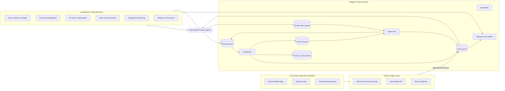
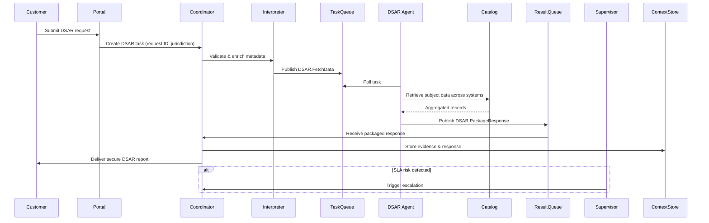

# Applying the Pidgeon Protocol to Privacy and Data Protection Operations in B2C Enterprises

## Executive Summary

Consumer-facing enterprises process unprecedented volumes of personal data across digital channels, loyalty programs, and AI-powered customer experiences. Regulatory mandates such as GDPR, CCPA/CPRA, LGPD, and emerging AI transparency rules require demonstrable controls over how that data is collected, accessed, processed, and erased. Traditional privacy operations depend on manual workflows, brittle point-to-point system integrations, and opaque logging that cannot scale with real-time data subject interactions.

The Pidgeon Protocol (飞鸽传书) introduces a queue-centric, schema-validated message fabric that decouples AI agents and microservices from direct coupling. By adopting the protocol as the coordination layer for privacy and data protection operations, B2C organizations can implement policy-driven automation, verifiable audit trails, and adaptive risk mitigation at enterprise scale. This white paper describes how the protocol aligns with regulatory obligations, the architectural blueprint for deployment, technical safeguards, and a phased implementation roadmap for privacy leaders.

## Business Context and Regulatory Drivers

### Market Realities for B2C Privacy
- **Data Volume and Velocity:** Omnichannel commerce, personalization engines, and conversational agents continuously collect identifiers, behavioral events, and transactional data.
- **Customer Trust as Differentiator:** Consumers increasingly select brands that demonstrate transparent data handling and responsive privacy controls.
- **Operational Bottlenecks:** Privacy request backlogs, fragmented consent stores, and manual vendor assessments create compliance risk and customer friction.

### Regulatory Landscape Snapshot
- **GDPR (EU):** Articles 12–23 require timely fulfillment of Data Subject Access Requests (DSARs), rectification, and erasure.
- **CCPA/CPRA (US-CA):** Mandates consumer request portals, opt-out preference signals, and auditable data sharing disclosures.
- **LGPD (Brazil) & PDPA (APAC):** Expand global obligations around consent, breach notification, and cross-border transfer governance.
- **AI Transparency & Algorithmic Accountability Laws:** Demand explainable processing, bias monitoring, and consent-aware personalization.

These regulations converge on three imperatives: precise data lineage, policy-aligned automation, and immutable evidence of compliance activities. The Pidgeon Protocol’s asynchronous coordination directly supports these imperatives.

## Pidgeon Protocol Overview for Privacy Operations

The Pidgeon Protocol delivers a layered architecture where privacy workflows are orchestrated via message queues rather than direct API calls. Core elements include:
- **Coordinator:** Decomposes privacy tasks (e.g., DSAR fulfillment, consent updates, breach investigations) into sub-tasks routed to specialized agents.
- **Agent Pool:** Stateless services handling classification, retrieval, anonymization, encryption, reporting, and customer communications.
- **Interpreter:** Enforces schema validation, attaches semantic metadata (data subject ID, jurisdiction, sensitivity level), and normalizes policy context.
- **Supervisor:** Applies enterprise privacy policies, manages retries, tracks SLAs, and isolates non-compliant behaviors.
- **Context Store:** Maintains workflow state, evidence artifacts, and regulatory mappings.
- **Dead Letter Queue:** Captures exceptions for privacy officer review and corrective action.
- **Control & Security Layer:** Provides runtime overrides, cryptographic signing, encryption, and regional federation for lawful processing boundaries.

## Target Reference Architecture

This architecture encapsulates privacy operations into modular services orchestrated by the protocol. Each agent type (e.g., DSAR executor, consent reconciler, breach response analyst) can scale independently and plug into the shared message fabric.

## Key Privacy Operations Enabled

1. **Data Subject Rights Automation**
   - Orchestrate identity verification, data aggregation, redaction, and response packaging through specialized agents.
   - Maintain SLA compliance via Supervisor-managed retries and escalation triggers.
   - Produce immutable evidence packages stored in the context store and linked to outgoing communications.

2. **Consent Lifecycle Governance**
   - Harmonize consent changes from multiple channels with schema-validated events.
   - Distribute updates to marketing, analytics, and personalization systems through the protocol’s queues.
   - Apply jurisdiction-specific rules (e.g., opt-in vs. opt-out) via Interpreter metadata enrichment.

3. **Privacy Impact Assessments (PIAs) & Risk Monitoring**
   - Coordinate data discovery scans, risk scoring models, and mitigation tasks as asynchronous agent workflows.
   - Feed outputs into centralized dashboards with full traceability of decision rationale.

4. **Third-Party/Vendor Oversight**
   - Route vendor onboarding questionnaires, evidence collection, and continuous monitoring tasks.
   - Enforce policy checks before data sharing events through Supervisor-controlled control queues.

5. **Incident & Breach Response**
   - Trigger breach playbooks that notify legal, security, and communications agents.
   - Maintain chronological event logs with message signing for legal defensibility.

## Data Protection Controls Embedded in the Protocol

### Technical Safeguards
- **Encryption Everywhere:** TLS for in-flight queues, KMS-backed encryption for queue persistence, and field-level encryption in the context store.
- **Cryptographic Signing:** Messages signed with rotating keys ensure non-repudiation of privacy actions.
- **Role-Based Access Control:** Coordinator, agents, and observers authenticate via least-privilege service accounts and attribute-based policies.
- **Data Minimization:** Interpreter enforces schema versions that strip unnecessary fields before routing tasks.
- **Regional Federation:** Partitioned queues and context stores maintain data residency compliance across jurisdictions.

### Operational Safeguards
- **Policy Templates:** Supervisor enforces jurisdictional rules, retention schedules, and SLA commitments.
- **Privacy-by-Design Workflows:** Standardized agent interfaces encourage consistent controls across teams.
- **Auditability:** All messages, decisions, and escalations are preserved for regulators and internal audits.

## Sequence of a Data Subject Access Request

This sequence ensures each DSAR action is logged, policy-checked, and cryptographically verifiable.

## Implementation Roadmap

### Phase 0 – Strategy & Readiness (4–6 Weeks)
- Establish privacy steering committee with legal, security, product, and customer support stakeholders.
- Map existing privacy workflows, data stores, and SLA requirements.
- Define canonical message schemas for DSAR, consent, breach, and vendor workflows.

### Phase 1 – Core Protocol Deployment (8–12 Weeks)
- Deploy Tier 1 Pidgeon components (Coordinator, Agent Pool, Task/Result Queues) in a secure cloud environment.
- Implement DSAR agent as MVP use case; integrate with data catalog and customer portal.
- Configure Interpreter for schema validation and metadata tagging (region, data type).

### Phase 2 – Production Hardening (12–16 Weeks)
- Introduce Supervisor for SLA monitoring, retries, and policy enforcement.
- Stand up context store with encryption-at-rest and immutable audit trails.
- Implement Dead Letter Queue review processes and dashboards.
- Integrate consent management and vendor oversight workflows.

### Phase 3 – Enterprise-Grade Enhancements (12+ Weeks)
- Enable Control Queue for real-time overrides and emergency halts.
- Add cryptographic signing, hardware-backed key storage, and regional federation.
- Expand agent library for privacy impact assessments, algorithmic fairness audits, and automated reporting.
- Integrate observability stack (tracing, metrics, anomaly detection) for privacy KPIs.

## Success Metrics and KPIs
- **DSAR SLA Compliance:** ≥95% requests fulfilled within mandated timelines.
- **Consent Sync Latency:** <5 minutes between signal receipt and downstream enforcement.
- **Audit Finding Reduction:** ≥50% decrease in privacy audit remediation items year-over-year.
- **Incident Response Time:** <24 hours from detection to regulatory notification for qualifying breaches.
- **Operational Efficiency:** ≥30% reduction in manual effort for privacy operations teams.

## Risk Considerations and Mitigations
- **Change Management Resistance:** Address via cross-functional training and a privacy-by-design playbook for product teams.
- **Legacy System Integration:** Use protocol adapters and phased data catalog coverage to prioritize high-risk systems first.
- **Model/Agent Drift:** Implement continuous validation pipelines, Supervisor alerts, and sandbox testing before deployment.
- **Regulatory Evolution:** Maintain modular schema versions and policy packs to adapt quickly to new requirements.

## Conclusion

Implementing the Pidgeon Protocol as the privacy and data protection backbone enables B2C enterprises to transform compliance obligations into a scalable, trust-building capability. Its asynchronous, schema-driven coordination layer unifies privacy intake channels, automates policy enforcement, and delivers defensible audit evidence—while preserving flexibility to integrate new agents, vendors, and regulatory mandates. Organizations that invest in this architecture will be positioned to deliver personalized experiences with uncompromising data stewardship, reinforcing customer trust in the AI-driven era.
